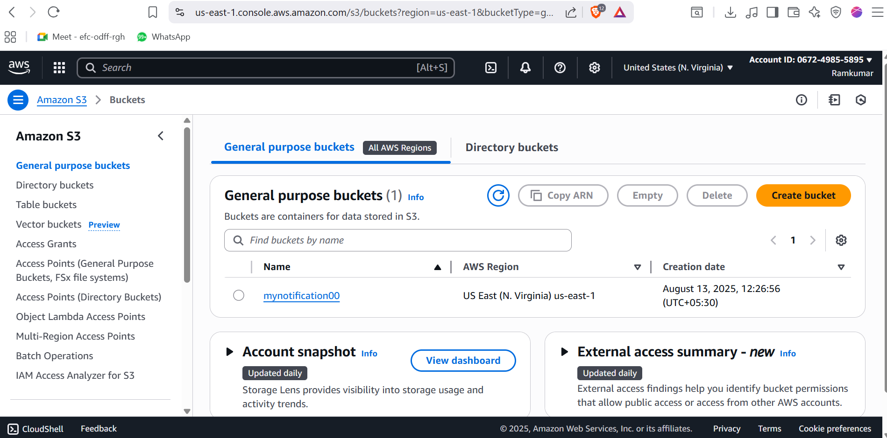
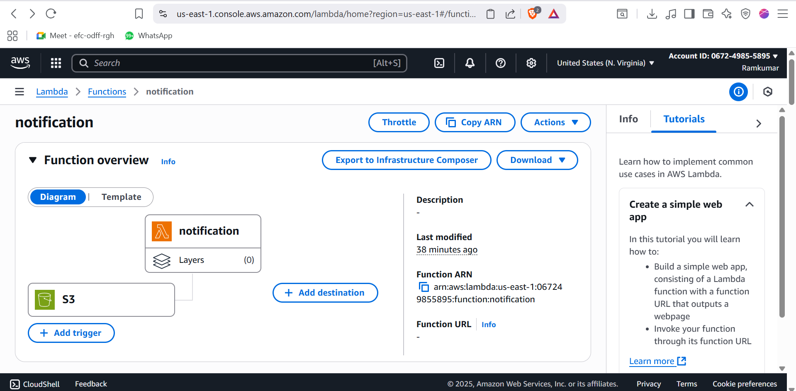
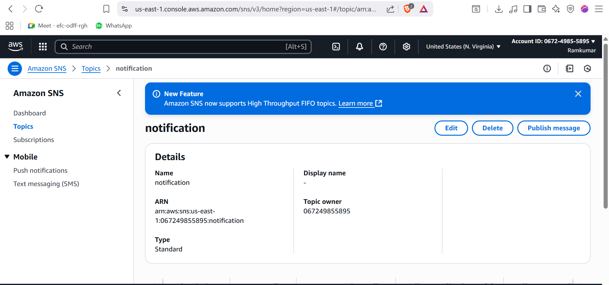
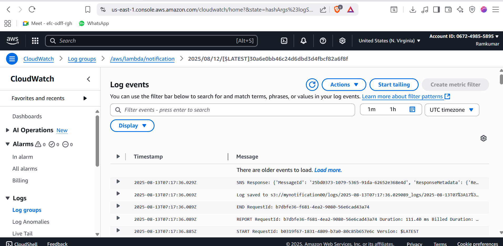
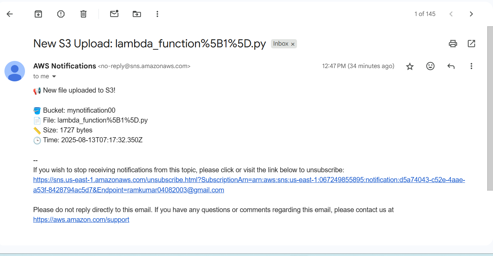

# Mass_Email_System_using_AWS

This project demonstrates a **serverless mass emailing system** built using **AWS Services** such as **S3**, **Lambda**, **CloudWatch**, and **SNS**.  
It allows uploading contact lists to S3, processing them with Lambda, and sending email/SMS notifications using SNS.  
CloudWatch is used for scheduling and monitoring.

---

## Architecture Overview

1. **Amazon S3** – Stores the uploaded `contacts.csv` file containing email or phone number lists.
2. **AWS Lambda** – Processes the contact file and triggers SNS notifications.
3. **Amazon SNS** – Sends the notifications (email or SMS) to subscribers.
4. **Amazon CloudWatch** – Triggers the Lambda function on a schedule (e.g., daily) and monitors execution logs.

---

## Workflow

1. **Upload Contact File to S3**  
   The contact file is uploaded to a designated S3 bucket.  
   

2. **Lambda Processing**  
   Lambda retrieves the file, parses it, and sends messages to the SNS topic.  
   

3. **SNS Notification**  
   SNS sends notifications to all subscribed endpoints (emails/phone numbers).  
   

4. **CloudWatch Scheduling & Monitoring**  
   CloudWatch EventBridge rule triggers the Lambda on a schedule and logs execution results.  
   

---

## AWS Services Used

- **Amazon S3** – Stores the contact file.
- **AWS Lambda** – Serverless function for processing and triggering SNS.
- **Amazon SNS** – Sends notifications to subscribers.
- **Amazon CloudWatch** – Triggers Lambda and monitors performance.

---

## How to Deploy

1. **Create an S3 Bucket**  
   Example bucket name: `mynotification00`.

2. **Create an SNS Topic**  
   Example ARN:  arn:aws:sns:us-east-1:123456789012:notification

3. **Create a Lambda Function**  
- Attach `AmazonS3FullAccess`, `AmazonSNSFullAccess`, and `CloudWatchFullAccess` IAM policies.
- Add environment variables for bucket name and SNS topic ARN.

4. **Set Up CloudWatch Rule**  
- Create a schedule expression (`cron` or `rate`) to trigger Lambda.
- Connect CloudWatch Logs for monitoring.

---

## Example Lambda Code (Python)

```python
import boto3
import csv
import os

s3 = boto3.client('s3')
sns = boto3.client('sns')

BUCKET_NAME = os.environ['BUCKET_NAME']
SNS_TOPIC_ARN = os.environ['SNS_TOPIC_ARN']

def lambda_handler(event, context):
 file_key = 'contacts.csv'
 response = s3.get_object(Bucket=BUCKET_NAME, Key=file_key)
 contacts = response['Body'].read().decode('utf-8').splitlines()

 for contact in contacts:
     sns.publish(
         TopicArn=SNS_TOPIC_ARN,
         Message=f"Hello {contact}, this is a mass notification!"
     )
 return {"status": "Notifications sent"}


